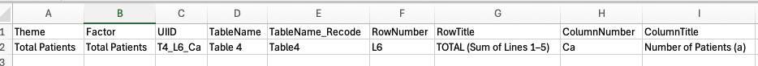
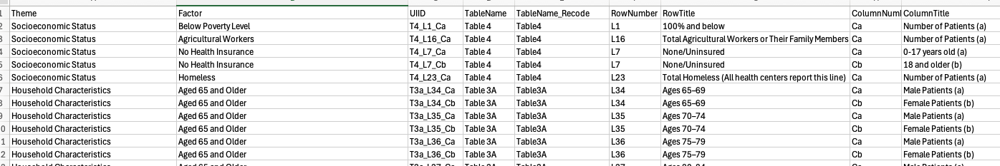

## Step 1: Environment setup

## Purpose
To set up the environment with packages containing functions needed to execute the analysis.

Call required packages
```{r setup}
suppressPackageStartupMessages({
  library(tidyverse)    # General functions
  library(dplyr)        # Pipe operations
  library(data.table)   # Write output to .csv
  library(openxlsx)     # Read input from Excel
  library(zipcodeR)     # Zip code based geographic functions
  library(janitor)      # Clean and standardize column names and quick frequency tables
  library(DT)           # Well formatted HTML tables
  library(ggplot2)      # Data visualization
  library(ggpubr)       # Data visualization
  library(forcats)      # Graphic options
  library(scales)       # Graphic options
  library(formattable)  # Graphic options
  library(htmltools)    # Render output in HTML
})
```

## Step 2: Selection of FQHC's of interest

## Purpose
To identify the HRSA unique identifier associated with FQHC's of interest for the analysis.

### 1. Requirements
User-defined parameters
- State(s) (2 character abbreviation, i.e., 'NY') of interest
- County(ies) (county name, i.e., 'New York County') of interest

### 2.  Identify zip codes
Establish function to identify zip codes in defined counties. This function requires two arguments:
-   target_state is the state of interest
-   target_counties is a list of counties of interest within the target state

It uses the zipcodeR package to load a dataframe of zipcodes in the United States.  When running this function, the resulting dataframe should be named 'zips'.

```{r zips}
get_zips <- function(target_state, target_counties){
  zips <- zipcodeR::zip_code_db %>%
  select(zipcode,state,county) %>%
  filter(state == target_state) %>%
  filter(county %in% target_counties) %>%
  distinct()
  
  return(zips)
}
```

### 3.  Identify FQHC's
Establish function to read in UDS Health Center Info file and limit the FQHC's to those in the target zip codes. This function requires two arguments:
- file_name is the name of the downloaded UDS data file
- target_state is the state of interest

It leverages the dataframe generated in Step 2 to limit centers located in zip codes of interest.

There are two downloadable UDS files available in HRSA's electronic reading room. The h80 file contains data for all full grantees while the lal file contains data for all FQHC look-alikes. The function can be run for one or both files, depending on researcher needs.

```{r id_centers}
get_centers <- function(file_name,target_state){
  centers <- read.xlsx(file_name,
                sheet = 'HealthCenterInfo') %>%
  filter(HealthCenterState == target_state) %>%
  select(BHCMISID,HealthCenterName,HealthCenterZIPCode) %>%
  inner_join(zips, by = c('HealthCenterZIPCode' = 'zipcode'))
  
  return(centers)
}
```

### 4. Union results
(Optional). If using files for both full FQHC's and look-alikes, establish a function to union the resulting datasets.

```{r combine_centers}
get_combined_centers <- function(h80_dataframe, lal_dataframe){
  all_centers <- rbind(h80_dataframe, lal_dataframe)
  
  return(all_centers)
}
```

### 5. Output results
Writes the all_centers dataframe to the working directory as a .csv.

```{r output_centers}
write_output <- function(df,file_name){
  fwrite(df,file_name)
}
```

## Example use 

```{r run_step2} 
zips <- get_zips(target_state = 'NY', target_counties = c('Allegany County', 'Cattaraugus County', 'Chautauqua County', 'Erie County','Genesee County', 'Monroe County', 'Niagara County', 'Orleans County','Wyoming County'))

centers_h80 <- get_centers(file_name = '../data/h80-2023.xlsx', target_state = 'NY')

centers_lal <- get_centers(file_name = '../data/lal-2023.xlsx', target_state = 'NY')

all_centers <- get_combined_centers(h80_dataframe = centers_h80,lal_dataframe = centers_lal)

write_output(df = all_centers,file_name = 'all_centers.csv')
```

## Step 3: Process UDS data

## Purpose
UDS data is published in multi-tabbed Excel workbooks that require extensive manipulation to filter and format according to research needs.The purpose of this code is to create a reproducible workflow for ingesting, filtering, and transposing the data into dataframes for easier downstream use.

## Processing Steps:

### 1.  Variable mapping
Establish function to read in a mapping of required data elements. 
This function requires the path and filename of an Excel workbook that is pre-generated by the researcher to contain the table(s) and variable(s) needed for the study. The workbook must contain two tabs with the following elements/ format:

Total Patient Mapping

```{r factor_map_total}

```

Variables of Interest Mapped to UDS Data Elements

```{r factor_map_index_vars}

```

Function to import the factor map.

```{r factor_map}
get_factor_map <- function(map_file){
  map <- rbind(
    read.xlsx(map_file, sheet = 'total_patient_mapping'),
    read.xlsx(map_file, sheet = 'index_mapping')
  )
  return(map)
}
```

### 2.  Read in selected FQHC's
(Optional) Establish a function to read in a file of FQHC's whose data will be analyzed in the study.  See id_centers.Rmd for the code to produce a the file containing the FQHC's of interest. This function requires the path and filename of that file.

```{r import_centers}
get_centers <- function(center_file) {
  centers <- read.csv(center_file,
                colClasses = "character")
  return(centers)
}
```

### 3. Establish a function to import and transform a single tab of data within the UDS workbook. 
This function requires two arguments:
- The source of the UDS data. There are two downloadable UDS files available in HRSA's electronic reading room. The h80 file contains data for all full grantees while the lal file contains data for all FQHC look-alikes. The function can be run for one or both files, depending on researcher needs.
- The sheet name, which is the name of the tab in the UDS workbook that corresponds to a data table.

This function:
- Reads in a given sheet from the specified workbook
- Transposes the data from wide to long
- Inner joins the factor map to limit variables to those of interest
- Appends the source table as a variable to the datatable
- Inner joins the centers of interest (if using this filter) to limit the data to only the required centers. If not using this filter, this join can be deleted or commented out.

```{r uds_data}
get_data <- function(data_source,sheet_name){
  uds_data <- read.xlsx(data_source,sheet = sheet_name) 
  
  n_cols <- ncol(uds_data)
  
  uds_data <- uds_data %>%
    pivot_longer(cols = 3:n_cols,
                 names_to = 'UIID',
                 values_to = 'response') %>%
    inner_join(df_factor_map, by = 'UIID') %>%
    mutate(source_table = sheet_name) %>%
    inner_join(df_centers[,c('BHCMISID','HealthCenterName')], by = 'BHCMISID')
  
  return(uds_data)
}
```

### 4. Establish a function to loop through all tabs in the UDS workbook consolidate the data into a single dataframe.
This function:
- Initializes an empty dataframe to store loop results
- Loops through table names (tabs) specified in the factor map
- Executes the get_data function for each table name (tab)
- Returns a single dataframe containing all data for each table name (tab) and variable specified in the factor map 

```{r loop_wb}
process_tables <- function(data_source) {
  result <- NULL
  
  for(i in unique(df_factor_map$TableName_Recode)) {
    t <- get_data(data_source, i)
    
    if (is.null(result)) {
      result <- t
    } else {
      result <- rbind(result, t)
    }
  }
  
  return(result)
}
```

### 5. (Optional). Establish a function to union the dataframes for the full FQHC's and the look-alikes.

```{r union_df}
union_data <- function(df1,df2) {
  all_results <- rbind(df1,df2) %>%
  select(BHCMISID,HealthCenterName,TableName,TableName_Recode,
         Theme,Factor,UIID,RowTitle,ColumnTitle,response)
  return(all_results)
}
```

## Example use
```{r run_step3} 
df_factor_map <- get_factor_map(map_file = 'factor_map.xlsx')

df_centers <- get_centers(center_file = 'all_centers.csv')

h80_data <- process_tables(data_source = 'h80-2023.xlsx')
lal_data <- process_tables(data_source = 'lal-2023.xlsx')

all_data <- union_data(df1 = h80_data, df2 = lal_data)

fwrite(all_data,'all_data.csv')
```

## Step 4: Prep the data for analysis

## Purpose 
The purpose of this code is to create a reproducible workflow for exploring, cleaning, and preparing the data for downstream use.

## Processing Steps:

### 1.Read in preprocessed data (output from Step 3).
``` {r import_processed_data}
all_data <- fread('all_data.csv')

```

### 2. Perform data quality checks
- Confirm that the expected data is present for all centers 
```{r qc_center_count}
all_data %>%
  summarize(n_centers = n_distinct(BHCMISID),
            n_vars = n_distinct(UIID),
            .groups = 'drop')
```

- Check for missing or unexpected data values. Response data should be numeric.
```{r qc_missing}
all_data %>%
  tabyl(response) %>%
  filter(!str_sub(response,1,1) %in% seq(0,9)) %>%
  arrange(desc(n))
```
Missings are noted with '-' or '--'. Per email from HRSA, 
 '-' means no data entry by the center (true missing)
 '--' means suppressed patient counts due to small cell size (1-15 patients)

Recode these values to zero. Note: Depending on your use case and the frequency of missing values, you may choose a different treatment, i.e., censor affected records or facilities or impute a value.
``` {r qc_missing_recode}
all_data <- all_data %>%
  mutate(response_recode = ifelse(response %in% c('-','--'),'0',response)) %>%
  mutate(response_recode = as.numeric(response_recode))

```

- Assess the frequency of zero in the recoded response field.

* First check overall
``` {r qc_zero}
all_data %>%
  tabyl(response_recode) %>%
  filter(response_recode == 0)
```
* Now check by datapoint
``` {r qc_zero_dtl}
datatable(all_data %>%
  group_by(Factor,RowTitle,ColumnTitle) %>%
  mutate(total_responses = length(Factor)) %>%
  group_by(Factor,RowTitle,ColumnTitle,response_recode,total_responses) %>%
  summarize(response_freq = length(response_recode),
            .groups = 'drop') %>%
  filter(response_recode == 0) %>%
  mutate(prcnt_responses = round(response_freq/ total_responses,2)))
```

Determine if the zero fill rates are acceptable per your research plan.

### 3.  Compute variable rates.
* Create denominator dataframe (total patients).
```{r denom_df}
df_total_patients <- all_data %>%
  filter(Theme == 'Total Patients') %>%
  select(BHCMISID,HealthCenterName,response_recode) %>%
  rename('total_patients' = 'response_recode') 
```

* Create numerator dataframe (selected variables).
```{r num_df}
df_index_vars <- all_data %>%
  filter(!Theme == 'Total Patients') 
```

* Consolidate multiple datapoints into each variable.
In this step, multiple datapoints are summed to compute the overall variable value, i.e., datapoints for each individual age are summed to compute the count of patients under age 18.
```{r consolidate_vars}
df_metrics <- df_index_vars %>%
  group_by(BHCMISID,HealthCenterName,Theme,Factor) %>%
  summarize(response_total = sum(response_recode),
            .groups = 'drop') 
```
  
* Compute the rate for each variable by joining the total patients (denominator) dataframe.
```{r compute_rates}
df_metrics <- df_metrics %>%
  left_join(df_total_patients, by = c('BHCMISID','HealthCenterName')) %>%
  mutate(prcnt_patients = round(response_total / total_patients,2))
```

### 4. Check distribution of rates within each variable.
```{r chk_dist}
datatable(df_metrics %>%
    group_by(Theme,Factor) %>%
    summarize(n = length(response_total),
              min_response = min(prcnt_patients),
              p25_response = round(quantile(prcnt_patients, probs = 0.25),2),
              p50_response = round(quantile(prcnt_patients, probs = 0.50),2),
              p75_response = round(quantile(prcnt_patients, probs = 0.75),2),
              max_response = max(prcnt_patients),
              .groups = 'drop') %>%
    mutate(iqr_response = p75_response - p25_response, .after = 'n')
)
```

```{r distplot}
get_dist_plot <- function(df,tgt_Theme,tgt_levels){
    d <- df %>%
      filter(Theme == tgt_Theme) %>%
      mutate(ordered_Factor = factor(Factor, levels = tgt_levels))
    
    plt <- ggplot(d,aes(x = ordered_Factor,y=prcnt_patients)) + 
      geom_boxplot() +
      scale_x_discrete(labels = label_wrap(width = 15)) +
      scale_y_continuous(labels = scales::percent) +
      xlab('') +
      ylab('Percent of Patients') +
      theme_classic() +
      theme(panel.border = element_rect(color = "black", fill = NA, linewidth = 1),
            axis.text.y = element_text(size = 12),
            axis.text.x = element_text(size =12)) + 
      ggtitle(d$Theme)
    
    return(plt)
  }
```

* Check distribution for Household Characteristics

``` {r hhc}
get_dist_plot(df = df_metrics, 
                  tgt_Theme = 'Household Characteristics',
                  tgt_levels = c('Aged 17 and Younger','Aged 65 and Older','Best Served in a Language Other than English')
              )
```

* Check distribution for Race/ Ethnicity

``` {r race}
get_dist_plot(df = df_metrics, 
                  tgt_Theme = 'Racial & Ethnic Minority Status',
                  tgt_levels = c('American Indian or Alaska Native','Asian','Black or African American','Hispanic or Latino (of any race)','Native Hawaiian or Pacific Islander','Two or More Races')
  )
```

American Indian or Alaska Native and Native Hawaiian or Pacific Islander are almost never observed in the data; decide whether to suppress based on your research needs.

* Check distribution for Socioeconomic Status

```{r ses}
get_dist_plot(df = df_metrics, 
                  tgt_Theme = 'Socioeconomic Status',
                  tgt_levels = c('Agricultural Workers','Below Poverty Level','Homeless','No Health Insurance')
  )
```

Agricultural Workers rarely appear in the data but there is one center with a higher rate so consider keeping this datapoint.

* Check distribution for Gender and Sexual Minority Status

```{r gender_sexual}
get_dist_plot(df = df_metrics, 
                  tgt_Theme = 'Gender & Sexual Minority Status',
                  tgt_levels = c('Gender Minority Status','Sexual Minority Status')
  )
```

* Check distribution for Potentially Stigmatized Health Conditions

```{r health}
get_dist_plot(df = df_metrics, 
                  tgt_Theme = 'Potentially Stigmatized Health Conditions',
                  tgt_levels = c('HIV','Mental Health Disorder','Substance Use Disorder')
  )
```

### 4. Output final prepped data for next step.

```{r output_metrics}
fwrite(df_metrics,'df_metrics.csv')
```

## Step 5: Compute the SVI and analyze results

## Purpose 
UDS data can be used to compute a social vulnerability index based on the CDC framework. The purpose of this code is to create a reproducible workflow for using prepared UDS data to compute an SVI at 3 levels: variable, theme, and overall.

## Processing Steps:

### 1. Read in prepared data.
``` {r import_prepped_data}
df_metrics <- fread('df_metrics.csv')

```

### 2. Establish functions for computing SVI at all three levels.
- Variable level 
```{r svi_level_var}
calc_svi_var <- function(df_name) {
  var_level <- df_name %>%
    group_by(Theme,Factor) %>%
    mutate(factor_percentile = round(percent_rank(prcnt_patients),3))
  return(var_level)
}
```

- Theme level
```{r svi_level_theme}
calc_svi_theme <- function(df_name) {
  theme_level <- df_name %>%
    group_by(BHCMISID,HealthCenterName,Theme) %>%
    summarize(summed_factor_percentiles = sum(factor_percentile),
              .groups = 'drop') %>%
    group_by(Theme) %>%
    mutate(theme_percentile = round(percent_rank(summed_factor_percentiles),3))
  
  return(theme_level)
}
```
- Overall level
``` {r svi_overall}
calc_svi_overall <- function(df_name) {
  overall_level <- df_name %>%
    group_by(BHCMISID,HealthCenterName) %>%
    summarize(summed_theme_percentiles = sum(theme_percentile),
              .groups = 'drop') %>%
    mutate(svi_percentile = round(percent_rank(summed_theme_percentiles),3))
  
  return(overall_level)
}
```

### 3. Run the functions
```{r run_svi_functions}
df_variable_rankings <- calc_svi_var(df_name = df_metrics)
df_theme_rankings <- calc_svi_theme(df_name = df_variable_rankings)
df_overall_rankings <- calc_svi_overall(df_name = df_theme_rankings)
```

### 4. Enhance the dataframes.
- For the overall rankings, convert the percentile to a score and create a risk classification variable.
```{r svi_score}
df_overall_rankings <- df_overall_rankings %>%
  mutate(svi_score = ceiling(svi_percentile *100)) %>%
  mutate(risk_level = ifelse(svi_score >= 80,'High',
                      ifelse(svi_score <= 20,'Low','Medium'))) %>%
  arrange(desc(svi_score))
```
- For the theme rankings, rank each FQHC within each theme. Handle tiebreakers by forcing ties to the lowest rank (this will result in some FQHC's sharing a rank when there is a tie).
```{r svi_tiebreaker}
df_theme_rankings <- df_theme_rankings %>%
  mutate(center_rank = rank(desc(theme_percentile),ties.method = 'min'))
```

### 5. Create visualizations (optional).
- Barplot of all selected FQHC's by overall SVI rank, classified by risk level
```{r svi_barplot}
ggbarplot(df_overall_rankings %>%
                     arrange(svi_score,HealthCenterName), 
                 x = "HealthCenterName", 
                 y = "svi_score",
                 fill = "risk_level",               # change fill color by cyl
                 color = "white",            # Set bar border colors to white
                 sort.val = "asc",           # Sort the value in ascending order
                 sort.by.groups = FALSE,      # Sort inside each group
                 sort.by = 'HealthCenterName',
                 x.text.angle = 90           # Rotate vertically x axis texts
) +
  coord_flip() +
  ggtitle('Social Vulnerability Index Score') +
  xlab('') +
  ylab('SVI Score') +
  scale_fill_manual(name="Risk Level", 
                    values = c("High" = "orange","Medium" = "grey","Low" = "lightblue"),
                    breaks = c('High','Medium','Low')) +
  theme(plot.title = element_text(hjust = 0),
        legend.justification = "left",
        legend.position = "top",
        plot.margin = margin(5,5,5,5, "pt"),  # Reduce margins
        axis.text.y = element_text(size = 8))     # Smaller text
```
